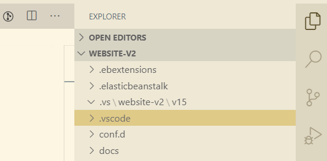

# Code Style and Formatting

### Install VSCode Recommended Extensions

In `.vscode/settings.json` you will see the recommended extensions:

```text
  "recommendations": [
    "ms-python.python",
    "esbenp.prettier-vscode",
    "ban.spellright"
  ],
```

#### 1. Python \(ms-python.python\)

Ties your virtual environment automatically to VSCode when starting.

#### 2. Prettier - Code formatter \(esbenp.prettier-vscode\)

Code formatter for our frontend code base.

#### 3. Spell Right \(ban.spellright\)

Check your spelling when writing any strings when coding.

### Make Sure to Run VSCode on the Main Folder

Auto formatting will work if you ONLY run it from the main folder which means you can see the folder `.vscode`



### Disable Auto Formatting

Change this line `"editor.formatOnSave": true` into false, and you will be fine \(**do NOT commit this change** 😉\).

### Auto Format All Frontend Code Base

**🔴MAKE SURE YOU ARE ON THE SPA FOLDER 🔴**

```text
cd src/spa
```

Then, simply run the following commands:

```text
npm install -g npx
npx prettier@2.0.5 . --write
```

